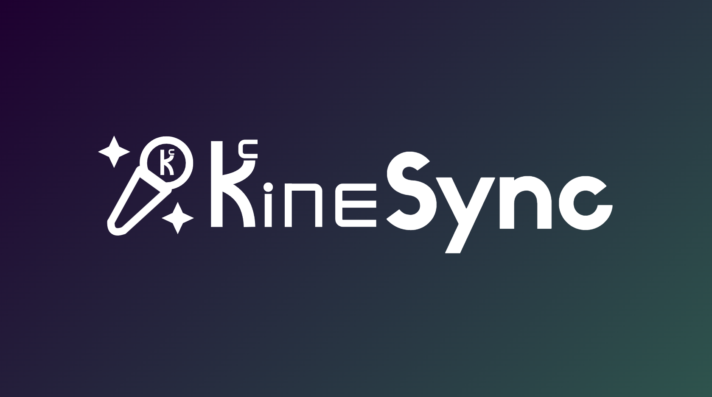
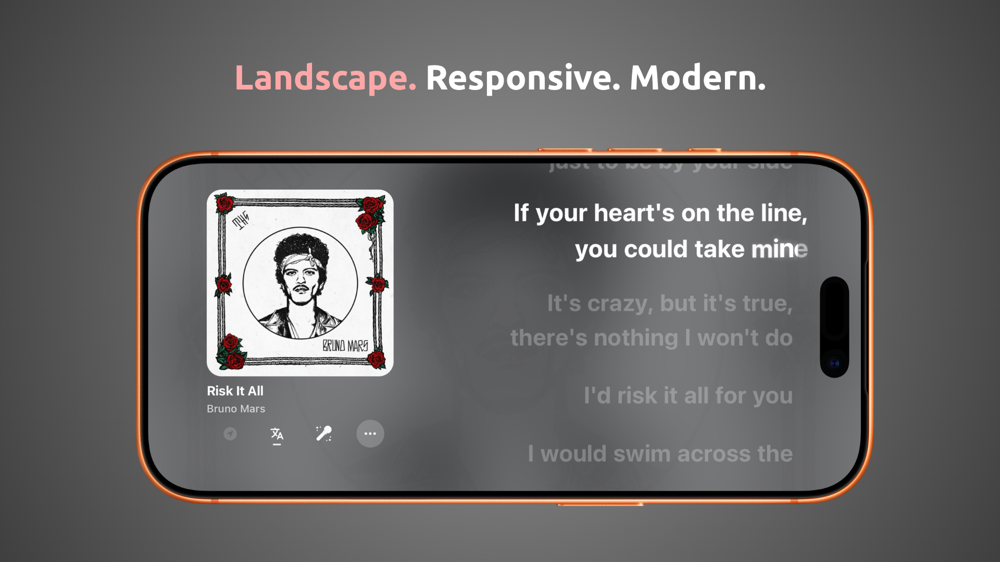

<p align="center">
  
</p>

<p align="center">
  A modern, beautiful mobile app for rendering syllable-synced lyrics synced with your Spotify playback using your own self-hosted Desktop Bridge.<br>
  Built natively for lyrics from <a href="https://github.com/Spikerko/spicy-lyrics">Spicy Lyrics</a>, a Spicetify extension.
</p>

<div align="center">

| | |
|:---:|:---:|
| ✅ **100% free & open-source** | ✅ **App on Expo** — sideloadable for iOS & Android |
| ✅ **Bridge on Electron** — native Windows media session | ✅ **No Spotify API or Premium** required |

</div>

## Project Layout

```
├── DesktopBridge/         Electron desktop companion
│   ├── src/
│   │   ├── index.js       Main process entry point
│   │   ├── index.html     Renderer UI
│   │   ├── lyrics/        Lyrics service (VM-based modular loader)
│   │   ├── lyricsService.js   Compatibility facade
│   │   ├── bridgeServer.js    Local WebSocket server
│   │   ├── bridgeRelayClient.js   Relay client
│   │   ├── spotifyDetector.js     Windows GSMTC media detection
│   │   ├── playbackController.js  Seek and playback management
│   │   └── artworkResolver.js     Deezer/iTunes album art
│   ├── native/            Windows native addons
│   │   ├── windows-media-session/  C++ GSMTC watcher (node-gyp)
│   │   └── spotify-seek-helper/    .NET seek helper
│   └── scripts/           Utility scripts
├── ExpoLyrics/            Expo React Native mobile app
│   ├── app/               File-based routes (Expo Router)
│   ├── components/        UI components
│   ├── lib/               Business logic
│   ├── store/             Zustand state management
│   └── providers/         React context providers
└── README.md
```

## Features

- **Real-time synced lyrics** — Line-by-line and word-by-word (karaoke) timing
- **Multi-source lyrics** — Musixmatch, QQ Music, Netease, Kugou, Spicy Lyrics, LRCLib, local vault
- **Album artwork** — Deezer + Apple iTunes Search (no API keys needed)
- **AI translation** — Optional Gemini translation of lyrics
- **Remote relay** — ngrok-based public relay for listening outside your home network
- **Lyrics vault** — Export and archive lyrics locally (TTML format)
- **Live Activities** — iOS Dynamic Island / Lock Screen lyrics display (currently broken)
- **Animated reveals** — Smooth karaoke-style word highlighting with sustain effects

<p align="center">
  
</p>

<p align="center">
  
</p>

## Prerequisites

- **Windows 10/11** for the Desktop Bridge
- **Node.js 20+** and npm
- **Expo Go** or a development build on your phone

_Optional (only needed to compile native binaries from source):_
Visual Studio 2022 with C++ workload, .NET SDK 9+, Python 3.x

_Recommended:_
- **Spicetify** + **Adblockify** + **Spicy Lyrics** for the best lyrics experience
- **EeveeSpotifyReincarnated** on iOS

## Quick Start

### 1. Install dependencies

```powershell
cd DesktopBridge
npm install        # automatically downloads prebuilt native binaries

cd ..\ExpoLyrics
npm install
```

### 2. Start the desktop bridge

```powershell
cd DesktopBridge
npm run start
```

### 3. Start the Expo app

```powershell
cd ExpoLyrics
npx expo start -c --tunnel
```

Scan the QR code with Expo Go. In the app's **Bridge Settings**, enter your desktop's LAN IP (e.g. `ws://192.168.1.100:3001`) and the bridge key you set.

## Remote Access (ngrok)

For connecting outside your home network, see the [ngrok relay setup in SETUP.md](SETUP.md#ngrok-relay-mode-remote-access).

## Lyrics Sources

The desktop bridge fetches lyrics from multiple sources. Configure in the bridge UI:

- **Spotify sign-in** — Required for Spicy Lyrics compatibility
- **Musixmatch user token** — For synced/rich lyrics (extract from browser dev tools)
- **Gemini API key** — For AI translation (get from [Google AI Studio](https://ai.google.dev/gemini-api/docs/api-key))

More configured sources = better coverage. Sources gracefully fall back when unavailable.

## Useful Commands

```powershell
# Desktop bridge
cd DesktopBridge
npm run start                    # Run desktop bridge
npm run relay                    # Local relay only
npm run relay:ngrok              # Relay through ngrok
npm run build:native-media       # Rebuild Windows media detector
npm run build:seek-helper        # Rebuild .NET seek helper
npm run diagnose:seek            # Diagnose seek issues
npm run check:lyrics-sources     # Check lyrics source health

# Expo app
cd ExpoLyrics
npx expo start -c --tunnel       # Start Expo with tunnel
npx tsc --noEmit                 # Type-check

# Syntax check
cd DesktopBridge
node --check src\index.js
```

## Architecture

```
Spotify (Windows) ──► GSMTC Watcher (C++) ──► Desktop Bridge (Electron)
                                                     │
                        ┌────────────────────────────┤
                        │              ┌─────────────┤
                   Lyrics Sources     Relay (ngrok)   │
                   (Musixmatch, QQ,    │              │
                    Netease, etc.)      │              │
                        │              │     Local WebSocket
                        ▼              ▼         :3001
                   Lyrics Engine ◄─────┘         │
                        │                        │
                        ▼                        ▼
                   Mobile App ◄────── WebSocket ─┘
                   (Expo/React Native)
```

The desktop bridge uses a shared Node.js VM context to load the lyrics service from 16 modular part files, preserving execution order from the original monolithic implementation.

## License

GNU GPL v3.0 — see [LICENSE](LICENSE) for details.
