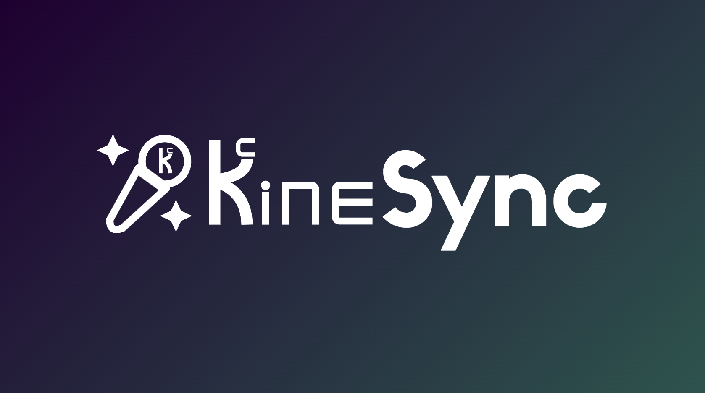
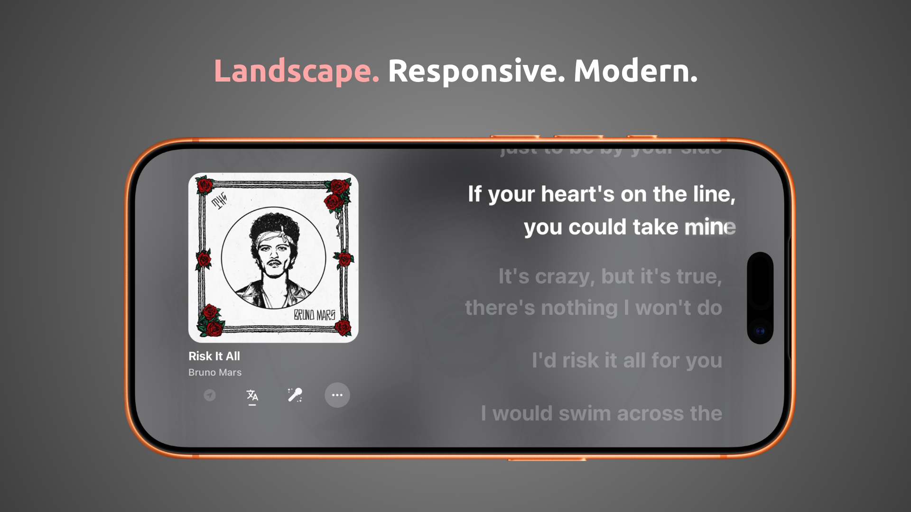

<p align="center">
  
</p>

<p align="center">
  A modern, beautiful mobile app for rendering syllable-synced lyrics with Spotify playback on your phone or through an optional self-hosted Desktop Bridge.<br>
  Built natively for lyrics from <a href="https://github.com/Spikerko/spicy-lyrics">Spicy Lyrics</a>, a Spicetify extension.
</p>

<div align="center">

| | |
|:---:|:---:|
| ✅ **100% free & open-source** | ✅ **App on Expo:** sideloadable for iOS & Android |
| ✅ **Phone-only mode:** no computer required | ✅ **No Spotify API or Premium** required |
| ✅ **Optional bridge on Windows or Docker** | ✅ **Local or remote playback support** |

</div>

## Project Layout

```
├── DesktopBridge/         Electron desktop companion
│   ├── src/
│   │   ├── index.js       Main process entry point
│   │   ├── index.html     Renderer UI
│   │   ├── lyrics/        Lyrics service (VM-based modular loader)
│   │   ├── lyricsService.js   Compatibility facade
│   │   ├── bridgeServer.js    Local WebSocket server
│   │   ├── bridgeRelayClient.js   Relay client
│   │   ├── spotifyDetector.js     Windows GSMTC media detection
│   │   ├── playbackController.js  Seek and playback management
│   │   └── artworkResolver.js     Deezer/iTunes album art
│   ├── native/            Windows native addons
│   │   ├── windows-media-session/  C++ GSMTC watcher (node-gyp)
│   │   └── spotify-seek-helper/    .NET seek helper
│   └── scripts/           Utility scripts
├── ExpoLyrics/            Expo React Native mobile app
│   ├── app/               File-based routes (Expo Router)
│   ├── components/        UI components
│   ├── lib/               Business logic
│   ├── store/             Zustand state management
│   └── providers/         React context providers
└── README.md
```

## Features

- **Real-time synced lyrics:** Line-by-line and word-by-word (karaoke) timing
- **Multi-source lyrics:** Musixmatch, QQ Music, Netease, Kugou, Spicy Lyrics, LRCLib, local vault
- **Album artwork:** Deezer + Apple iTunes Search (no API keys needed)
- **AI translation:** Optional Gemini translation of lyrics
- **Remote relay:** ngrok-based public relay for listening outside your home network
- **Lyrics vault:** Export and archive lyrics locally (TTML format)
- **Animated reveals:** Smooth karaoke-style word highlighting with sustain effects

<p align="center">
  
</p>

<p align="center">
  
</p>

## Prerequisites

- An Android device, or an iPhone/iPad with an IPA sideloading tool
- A Spotify account

No computer is needed after installing the mobile app when you choose
**Mobile-Only**. If you opt into Desktop Bridge, use Windows 10/11 for the
native installer or an `amd64` Windows, macOS, or Linux Docker host.

Node.js and npm are only required when running from source.

_Optional (only needed to compile native binaries from source):_
Visual Studio 2022 with C++ workload, .NET SDK 9+, Python 3.x

_Recommended:_
- **Spicetify Marketplace** + **Adblockify** + **Spicy Lyrics** for the best lyrics experience
- **EeveeSpotifyReincarnated** on iOS

## Quick Start

Setup choices are listed from easiest to most advanced. The Desktop Bridge is
optional: start with Mobile-Only unless you want tighter sync, desktop Spotify
playback, local lyrics, or remote relay support.

### Install on Android

[**Download the latest signed APK**](https://github.com/Kineticron/KineSync/releases/latest/download/KineSync-Android.apk),
then open it on the Android device. See the
[Android installation guide](ANDROID_INSTALL.md) for installation and checksum
verification.

### Install on iPhone or iPad

[**Download the latest unsigned IPA**](https://github.com/Kineticron/KineSync/releases/latest/download/KineSync-iOS-unsigned.ipa)
for SideStore, Sideloadly, or another IPA signer. With SideStore already set
up, you can
[install the latest IPA directly](sidestore://install?url=https%3A%2F%2Fgithub.com%2FKineticron%2FKineSync%2Freleases%2Flatest%2Fdownload%2FKineSync-iOS-unsigned.ipa)
or add the permanent
[KineSync app source](sidestore://source?url=https%3A%2F%2Fgithub.com%2FKineticron%2FKineSync%2Freleases%2Flatest%2Fdownload%2Fsidestore-source.json)
to install KineSync and receive update notices inside SideStore.

See the [complete iOS installation guide](IOS_INSTALL.md) for SideStore,
Sideloadly, refresh requirements, and troubleshooting.

### Choose how KineSync follows Spotify

1. **Mobile-Only (easiest, no Desktop Bridge):** During onboarding, choose
   **Use this phone only**, sign in to Spotify with an email address and
   password, and play Spotify inside KineSync. Google and Apple sign-in are not
   available in the embedded browser.
2. **Windows installer (optional Desktop Bridge):**
   [download the latest Windows `.exe`](https://github.com/Kineticron/KineSync/releases/latest/download/KineSync-Desktop-Windows-Setup.exe),
   install it, open KineSync, and scan its pairing QR code from the mobile app.
3. **Docker (optional Desktop Bridge):** use the
   [one-command Docker setup](DOCKER.md#one-command-install) or download the
   [ready-to-run setup bundle](https://github.com/Kineticron/KineSync/releases/latest/download/kinesync-docker-setup.zip).
4. **From source (advanced/development):** follow the
   [complete setup guide](SETUP.md#method-4-run-from-source-advanced).

With either bridge method, open Desktop Bridge and scan its pairing QR code.
The QR code supplies the bridge URL and handshake key, avoiding manual network
setup.

The published installer is unsigned unless maintainers configure the optional
`WINDOWS_CERTIFICATE_PFX_BASE64` and `WINDOWS_CERTIFICATE_PASSWORD` repository
secrets, so Windows SmartScreen may show a first-run warning.

### Run from source

For the quickest self-contained setup, follow the [instant Docker setup](DOCKER.md).
It covers configuration, Spotify login, ExpoLyrics pairing, optional ngrok
access, validation, updates, and troubleshooting. The steps below run the apps
from source on Windows.

### 1. Install dependencies

```powershell
cd DesktopBridge
npm install        # automatically downloads prebuilt native binaries

cd ..\ExpoLyrics
npm install
```

### 2. Start the desktop bridge

```powershell
cd DesktopBridge
npm run start
```

### 3. Start the Expo app

```powershell
cd ExpoLyrics
npx expo start -c --tunnel
```

Scan the QR code with Expo Go. In the app's **Bridge Settings**, enter your desktop's LAN IP (e.g. `ws://192.168.1.100:3001`) and the bridge key you set.

## Remote Access (ngrok)

For connecting outside your home network, see the [ngrok relay setup in SETUP.md](SETUP.md#ngrok-relay-mode-remote-access).

## Optional Docker Desktop Bridge

The self-contained `amd64` image runs Spotify for Linux, DesktopBridge, and
automatically configured Spicetify Marketplace with Adblockify. It uses Xpra
seamless forwarding, not VNC, to present the apps as individual native host
windows on Windows, macOS, and Linux. Desktop Bridge remains visible; Spotify
appears for the first login and is hidden after the account is persisted. The
one-command installer needs no source checkout or VNC credentials. Container
playback detection uses MPRIS over a shared D-Bus session; Windows native builds
continue using GSMTC.

See [DOCKER.md](DOCKER.md) for the start-to-finish setup, first-time Spotify
login, ExpoLyrics pairing, optional ngrok access, diagnostics, and verification.

## Lyrics Sources

The desktop bridge fetches lyrics from multiple sources. Relevant bridge UI settings:

- **Spotify sign-in:** Required for Spicy Lyrics compatibility
- **Musixmatch:** Anonymous access is configured automatically in both Desktop Bridge and mobile-only modes. An optional user token can be entered as a manual override for synced/rich lyrics.
- **Gemini API key:** For AI translation (get from [Google AI Studio](https://ai.google.dev/gemini-api/docs/api-key))

More configured sources = better coverage. Sources gracefully fall back when unavailable.

## Useful Commands

```powershell
# Desktop bridge
cd DesktopBridge
npm run start                    # Run desktop bridge
npm run relay                    # Local relay only
npm run relay:ngrok              # Relay through ngrok
npm run build:native-media       # Rebuild Windows media detector
npm run build:seek-helper        # Rebuild .NET seek helper
npm run diagnose:seek            # Diagnose seek issues
npm run check:lyrics-sources     # Check lyrics source health

# Expo app
cd ExpoLyrics
npx expo start -c --tunnel       # Start Expo with tunnel
npx tsc --noEmit                 # Type-check

# Syntax check
cd DesktopBridge
node --check src\index.js
```

## Releases

Each production version uses one normal GitHub Release named `v*`. The release
contains the Android app, iOS app, Windows installer, Docker setup, checksums,
and native Windows runtime files. See [RELEASES.md](RELEASES.md) for the release
process.

## Architecture

```
Spotify (Windows) ──► GSMTC Watcher (C++) ──► Desktop Bridge (Electron)
                                                     │
                        ┌────────────────────────────┤
                        │              ┌─────────────┤
                   Lyrics Sources     Relay (ngrok)   │
                   (Musixmatch, QQ,    │              │
                    Netease, etc.)      │              │
                        │              │     Local WebSocket
                        ▼              ▼         :3001
                   Lyrics Engine ◄─────┘         │
                        │                        │
                        ▼                        ▼
                   Mobile App ◄────── WebSocket ─┘
                   (Expo/React Native)
```

The desktop bridge uses a shared Node.js VM context to load the lyrics service from 16 modular part files, preserving execution order from the original monolithic implementation.

## License

GNU GPL v3.0. See [LICENSE](LICENSE) for details.
